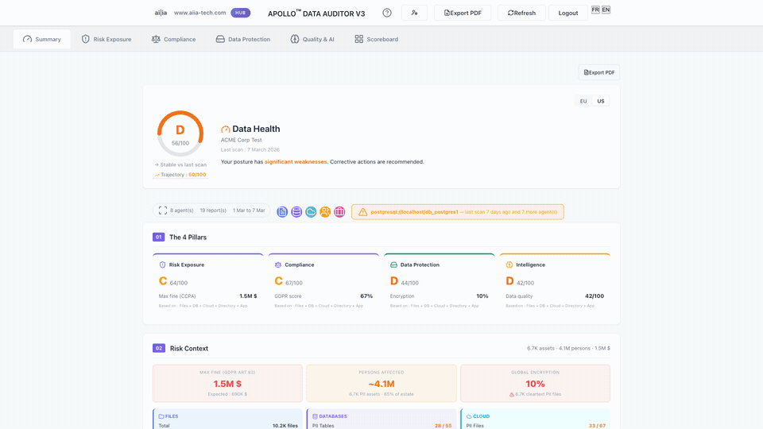

# APOLLO™ Data Auditor

**Every file is a potential risk. Measure it.**

[](LICENSE)
[]()
[]()

APOLLO Data Auditor scans your files, databases, and cloud. You get your financial exposure in euros and dollars — not an abstract score.



---

## Architecture

```
Agent (on-premise, pure collector)  →  Apollo Cloud Hub  →  Risk scores · Compliance dashboard
```

The agent sends counters and metadata only — never PII values. Raw data never leaves your infrastructure.

---

## 🎯 The Problem

SMEs hold thousands of files, databases, and cloud documents containing personal data. Without knowing. Without protecting them.

- **GDPR fines:** up to 4% of global revenue or €20M
- **CCPA penalties:** $7,988 per violation, no cure period
- **Average SME breach cost:** $3.31M (IBM/Ponemon 2025)

Enterprise solutions exist — at $50K–$150K/year. For a 50–500 employee company, that's not an option.

**APOLLO changes that.**

---

## ⚡ Quick Start

### 1. Download

```bash
# Linux
curl -sSL https://aiia-tech.com/download/install.sh | bash

# macOS
curl -sSL https://aiia-tech.com/download/install_macos.sh | bash

# Windows (PowerShell)
Invoke-WebRequest https://aiia-tech.com/download/install_windows.ps1 -OutFile install.ps1
.\install.ps1
```

### 2. Launch

```bash
# Linux / macOS
./apollo-agent --serve

# Windows (PowerShell)
.\apollo-agent.exe --serve
```

### 3. Use

Open http://localhost:8052 in your browser, enter your API key, and start scanning.

---

## 🔌 Connectors

| Source | Status | Types |
|--------|--------|-------|
| **Files** | ✅ | Local, NFS, SMB |
| **Database** | ✅ | PostgreSQL, MySQL, MongoDB, SQL Server |
| **Cloud** | ✅ | OneDrive, SharePoint |
| **Directory** | ✅ | Active Directory, LDAP |
| **ERP** | ✅ | Pennylane (more coming) |
| **Infrastructure** | ✅ | Hardware, OS, Backup, SMART |

**44 PII types** detected automatically across all sources.

---

## 📊 What You Get

### 6 Dashboard Modules

| Module | For | What It Shows |
|--------|-----|---------------|
| **Executive** | CEO, CFO | Global score, trajectory, top risks |
| **Risk Exposure** | CEO, CFO, Consultant | Financial exposure (€/$), Breach Theater simulation |
| **Compliance** | DPO, Legal, CISO | GDPR Art.9/30/32, NIS2, SOC2, CCPA, AI Act |
| **Data Protection** | MSP, Backup, IT | Backup resilience, encryption, data hygiene |
| **Intelligence** | CTO, ESN, AI Integrator | AI Readiness, data quality, blockers |
| **Scoreboard** | Auditor, Consultant | 71 scores, 319 metrics — full registry |

All values computed from your actual scan. Zero hardcoded constants.

---

## 🛡️ Security

- **Zero data exfiltration** — PII never leaves your infrastructure
- **Native Rust agent** — No dependencies, no server
- **Cloud scoring only** — Anonymized metadata sent to scoring engine
- **TLS 1.3 encryption** — All data in transit
- **GDPR compliant** — By design

---

## 📈 Performance

- Up to **1.16M rows/second** scan rate
- Full audit in **< 48 hours** (vs 3-6 months traditional)
- Unlimited re-scans included

---

## 🆓 Free Beta Access

**50 places available**

| Feature | Beta |
|---------|------|
| Sources | 5 |
| Scans | 25 |
| Price | €0 |

No credit card. No commitment.

**[Request Beta Access](https://aiia-tech.com)** or email contact@aiia-tech.com

---

## 📋 Requirements

- **Windows** 10/11 or **Linux** (Ubuntu 20.04+, Debian 11+)
- **macOS** 12+ (Apple Silicon & Intel)
- 4GB RAM minimum
- Network access to your data sources

---

## 📖 Documentation

- [Installation Guide](install.sh) (Linux) | [macOS](install_macos.sh) | [Windows](install_windows.ps1)
- [Security Policy](SECURITY.md)
- [Third-Party Licenses](THIRD_PARTY_LICENSES.md)

---

## 🤝 Support

- **Email:** contact@aiia-tech.com
- **Issues:** [GitHub Issues](https://github.com/ggabrie2025/apollo_data_auditor/issues)

---

## 📜 License

[Business Source License 1.1](LICENSE)

- ✅ Non-commercial use permitted
- ✅ Internal business use permitted
- ❌ Commercial redistribution requires license
- 📅 Change Date: 2030 → Apache 2.0

---

## 🏢 About

APOLLO Data Auditor is built by [aiia-tech.com](https://aiia-tech.com), founded by MIT Sloan Executive Program alumni.

**Vision:** Democratize enterprise-grade data auditing for European SMEs.

---

© 2025-2026 aiia-tech.com — APOLLO™ is a registered trademark.
